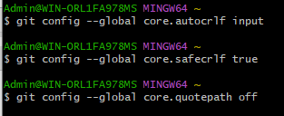
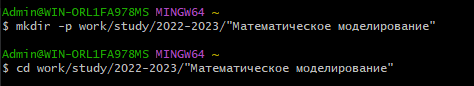
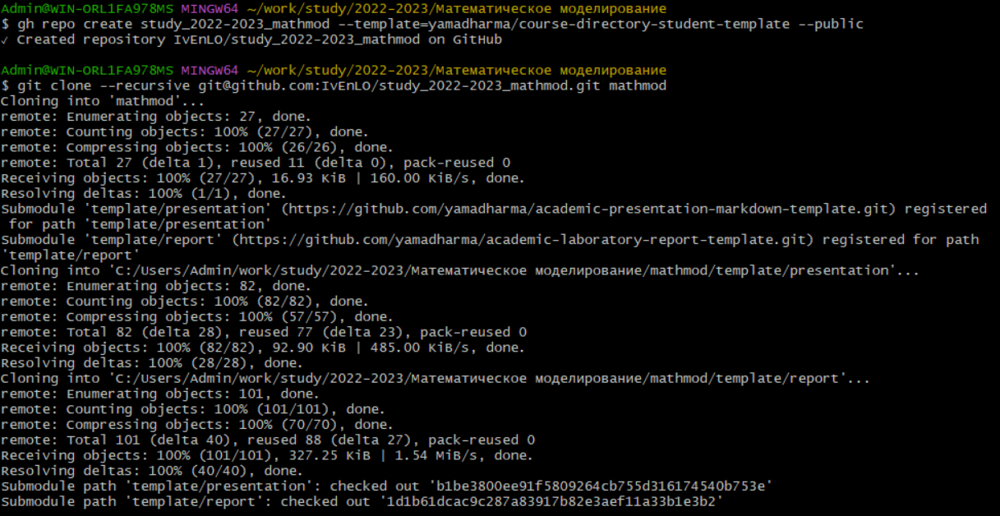
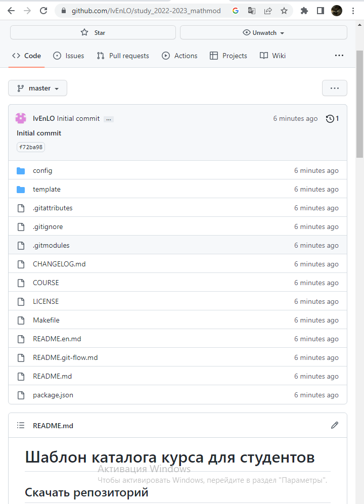
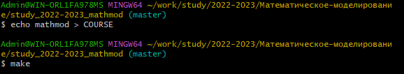

 **РОССИЙСКИЙ УНИВЕРСИТЕТ ДРУЖБЫ НАРОДОВ** 
 

 **Факультет Физико-Математических Наук** 

 **Кафедра прикладной информатики и теории вероятностей** 

   
 
 
   
 
 

 **ОТЧЁТ** 

 **ПО ЛАБОРАТОРНОЙ РАБОТЕ № 1** 

 *дисциплина: Математическое Моделирование* 

 
 
 
 
 
 
 
 
 
 
 
 
 
 
 
 
 
 
 
 
 
 
 
 
 
 

<u> Студент: Евдокимов Иван Андреевич </u>

Группа: НФИбд-01-20

<u> Преподаватель: Кулябов Дмитрий Сергеевич </u>

 **МОСКВА** 

 20<u>22</u>-20<u>23</u> г. 

  

 

---

**Техническое оснащение:**

+ Персональный компьютер с операционной системой Windows 10;
+ OBS Studio, использующийся для записи скринкаста лабораторной работы;
+ Приложение Visual Studio Code для редактирования файлов формата *md* , а также для конвертации файлов отчётов и презентаций;

 

**Цель работы:** Создать каталоги для работы на основе документа Рабочее пространство для лабораторной работы.

**Этапы работы:**

1)Выполняю следующие команды в MINGW64, чтобы git узнал моё имя и
электронную почту. 

git config --global user.name "IvEnLO"

git config --global user.email "i.evdokimov111@gmail.com"

2)Настраиваю гит в MINGW64:
git config --global core.autocrlf input
git config --global core.safecrlf true
git config --global core.quotepath off

2+)Устанавливаю github CLI:
https://cli.github.com/

2++)Регестрируюсь через windows консоль через команды

3)Создаю рабочее пространство:

mkdir -p ~/work/study/2022-2023/"Математическое-моделирование"

cd ~/work/study/2022-2023/"Математическое-моделирование"

gh repo create study_2022-2023_mathmod --template=yamadharma/course-directory-student-template --public

git clone --recursive git@github.com:IvEnLO/study_2022-2023_mathmod.git mathmod

4)Запускаю git командой в MINGW64:
git init

5)Захожу в папку проекта:
cd study_2022-2023_mathmod

6)Работа с make:
make help
make list

7)Удаление лишний файл:
rm package.json

8)Добавляю в курс и проверка:
echo mathmod > COURSE
make

9)Добавляю на git:
git add .

10)Делаю коммит:
git commit -am "feat(main): make course structure"

11)Заливаем на github:
git push -u origin master

Итог:

**Выводы:** Удалось создать каталоги для работы на основе документа Рабочее пространство для лабораторной работы.
