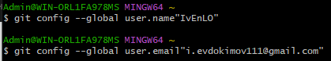
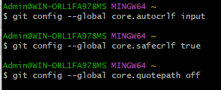
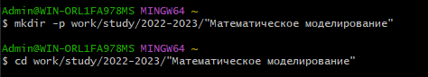
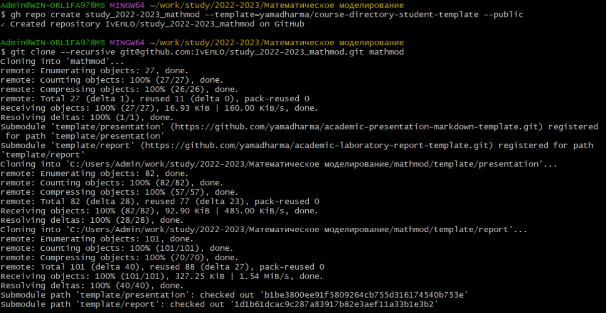
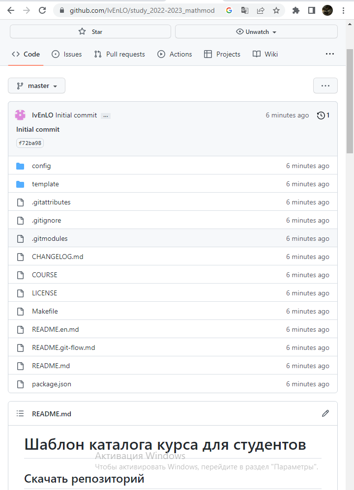

# Лабораторная работа №1 "Создать каталоги для работы на основе документа Рабочее пространство для лабораторной работы." 

## Прагматика

Работа выполнена для того чтобы научиться работать с GitHub научиться получать информацию о файлах и каталогах, создавать и удалять их, использовать несколько команд в строке и быстро использовать уже введённые команды, чтобы использовать полученные знания для дальнейшей работы.

## Цели

Создать каталоги для работы на основе документа Рабочее пространство для лабораторной работы.

## Актуальность

- Важно донести результаты своих исследований до окружающих
- Научная презентация --- рабочий инструмент исследователя
- Необходимо создавать презентацию быстро
- Желательна минимизация усилий для создания презентации

## Задачи

- Подключить Git к устройству
- Создать ренпозиторий 
- Выполнить несколько команда

## Работа (1)

## Работа (2)

## Работа (3)

## Работа (3.2)

## Результаты

Создать каталоги для работы

## Заключение

Я приобрел практические навыки взаимодействия пользователя с GitHub.