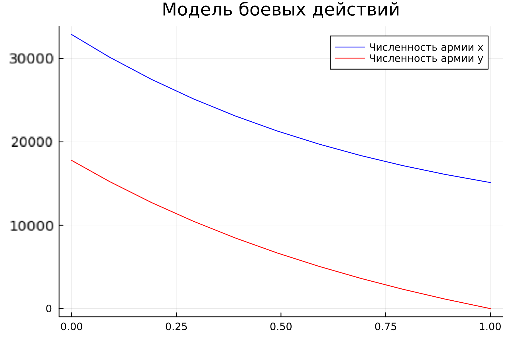
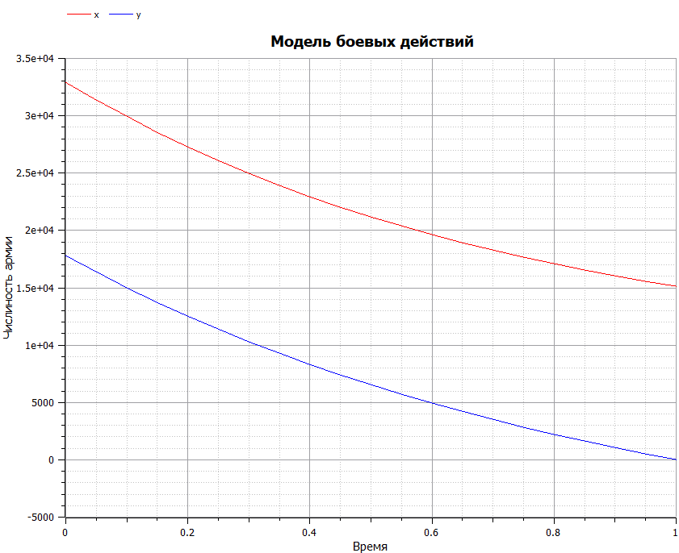
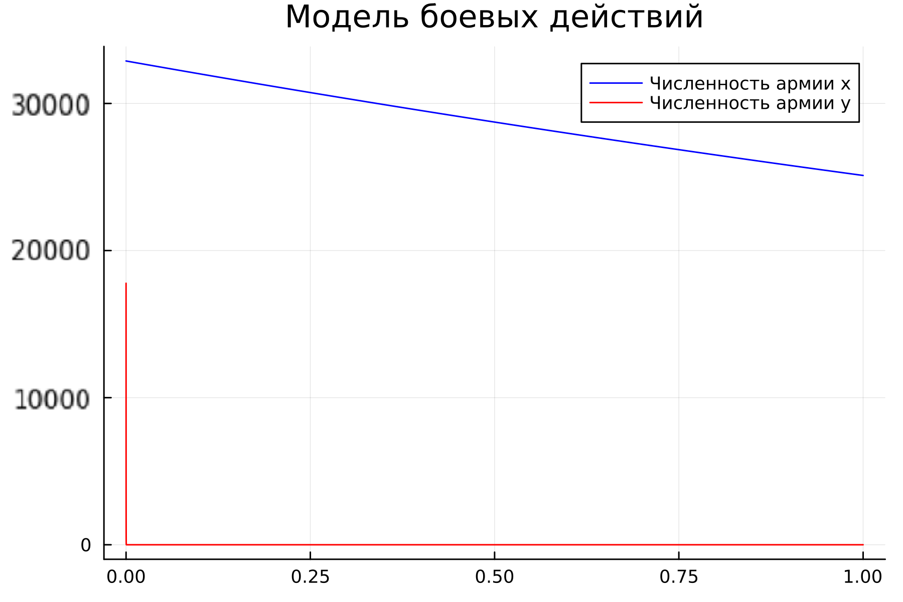
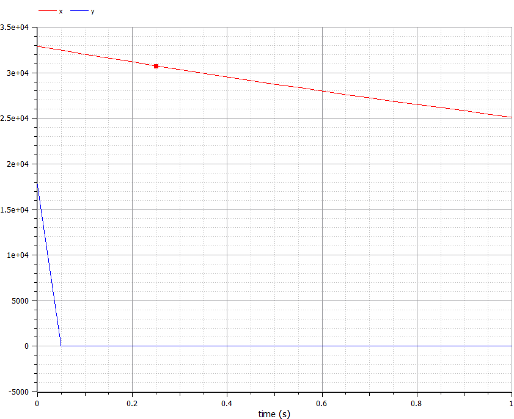

---
## Front matter
lang: ru-RU
title: Лабораторная работа №3. Модель боевых действий.
author:
    - Евдокимов Иван Андреевич. НФИбд-01-20

institute:
    - Российский Университет Дружбы Народов

date: 24 февраля, 2023, Москва, Россия

## Formatting
mainfont: PT Serif
romanfont: PT Serif
sansfont: PT Sans
monofont: PT Mono
toc: false
slide_level: 2
theme: metropolis
header-includes: 
 - \metroset{progressbar=frametitle,sectionpage=progressbar,numbering=fraction}
 - '\makeatletter'
 - '\beamer@ignorenonframefalse'
 - '\makeatother'
aspectratio: 43
section-titles: true
---

# Цели и задачи работы

## Цель лабораторной работы

Нам необходимо рассмотреть модели простейших боевых действий, так называемые модели Ланчестера. 
В моделях мы будем рассматривать два случая битв, сражение регулярных войск, сражение регулярных и партизанских войск.
Если численность армии обращается в нуль, то данная сторона считается проигравшей (при условии, что численность другой стороны в данный момент положительна). 

## Задачи лабораторной работы

1. Выявить два случая модели Ланчестера, разобрать их теоретическое выведение
2. Вывести уравнения для постоения моделей Ланчестера для двух случаев
3. Построить графики изменения численности войск, используя текст лабораторной работы
4. Определить победившую сторону

# Процесс выполнения лабораторной работы

# Теоретический материал 

Будем рассматривать два случая ведения боевых действий с учетом различных типов войск: 

1. Боевые действия между регулярными войсками 
2. Боевые действия с участием регулярных войск и партизанских отрядов 
 
## Теоретический материал. Первый случай:
Модель боевых действий между регулярными войсками описывается как:

$$
 \begin{cases}
	\frac{dx}{dt}= -a(t)x(t) - b(t)y(t) + P(t)
	\\   
	\frac{dy}{dt}= -c(t)x(t) - h(t)y(t) + Q(t)
 \end{cases}
$$

## Теоретический материал. Второй случай:
Модель боевых действий между регулярными войсками и партизанскими отрядами описывается как:

$$
 \begin{cases}
	\frac{dx}{dt}= -a(t)x(t) - b(t)y(t) + P(t)
	\\   
	\frac{dy}{dt}= -c(t)x(t)y(t) - h(t)y(t) + Q(t)
 \end{cases}
$$

## Постановка задачи

Между страной $X$ и страной $Y$ идет война. Численность состава войск исчисляется от начала войны, и являются временными функциями $x(t)$ и $y(t)$
В начальный момент времени страна $X$ имеет армию численностью 32 888 человек, а в распоряжении страны $Y$  армия численностью в 17 777 человек.
Для упрощения модели считаем, что коэффициенты $a, b, c, h$ постоянны. 
Также считаем $P(t), Q(t)$ непрерывные функции.
Постройте графики изменения численности войск армии $X$ и армии $Y$ для следующих случаев:

## Случай 1. Модель боевых действий между регулярными войсками

$$
 \begin{cases}
	\frac{dx}{dt}= -0.55x(t) - 0.77y(t) + 1.5sin(3t+1)
	\\   
	\frac{dy}{dt}= -0.66x(t) - 0.44y(t) + 1.2cos(t+1)
 \end{cases}
$$

 | 
:------------|------------:
{ #fig:001 width=50%} | { #fig:001 width=50%}

Победа достается армии $X$.

## Случай 2. Модель ведение боевых действий с участием регулярных войск и партизанских отрядов

$$
 \begin{cases}
	\frac{dx}{dt}= -0.27x(t) - 0.88y(t) + sin(20t)
	\\   
	\frac{dy}{dt}= -0.68x(t)y(t) - 0.37y(t) + cos(10t) + 1
 \end{cases}
$$

 | 
:------------|------------:
{ #fig:002 width=50%} | { #fig:002 width=50%}

# Вывод

Рассмотрели модели простейших боевых действий, так называемые модели Ланчестера. В моделях мы рассмотрели два случая битв: 

1. Сражение регулярных войск.
2. Сражение регулярных и партизанских войск.

Проверили как работают модели в этих случаях, построили графики и сделали вывод о том, кто станет победителем в данных случаях.