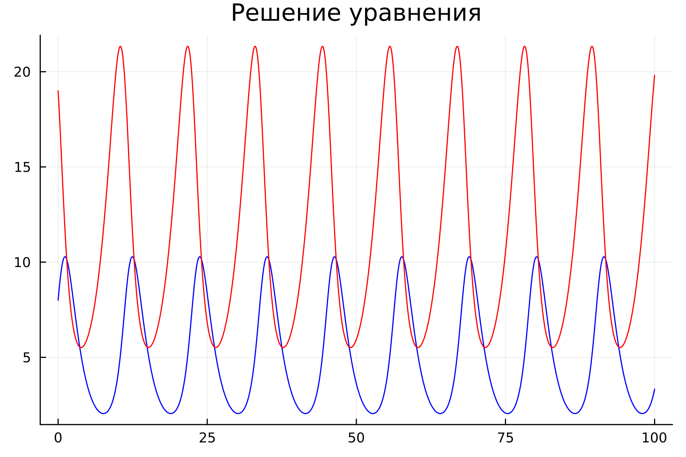
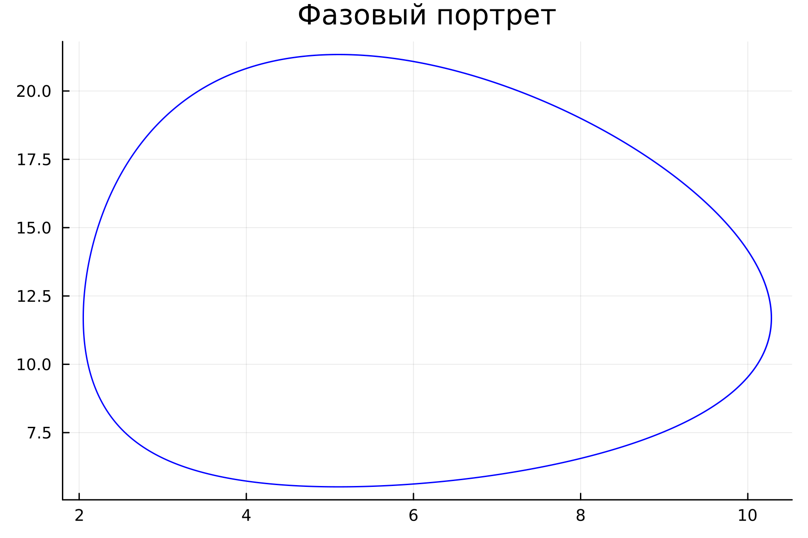
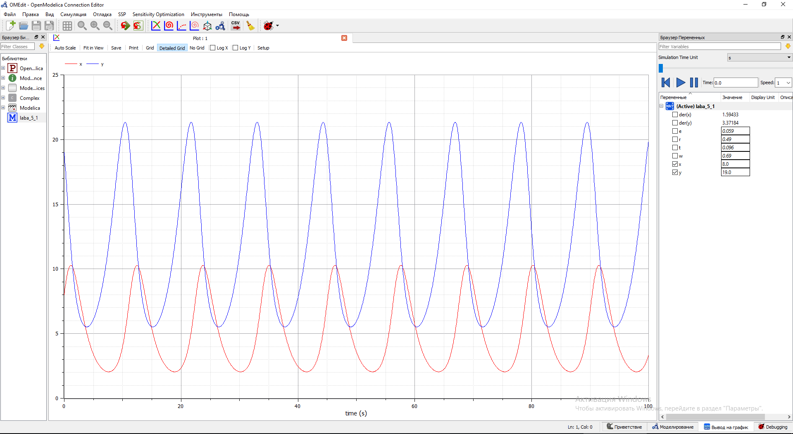
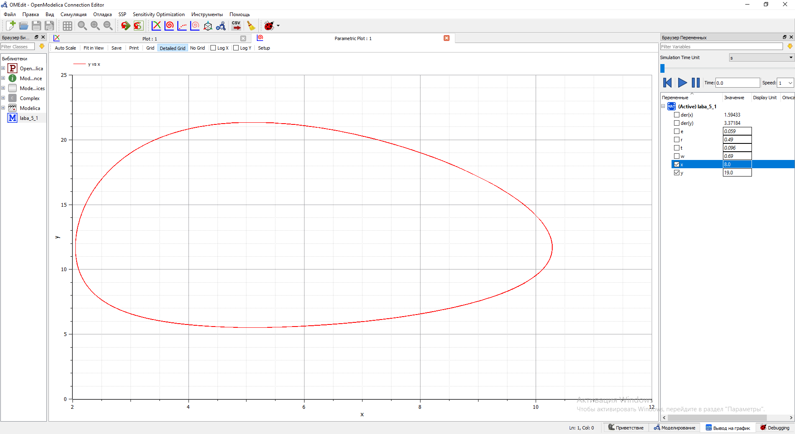
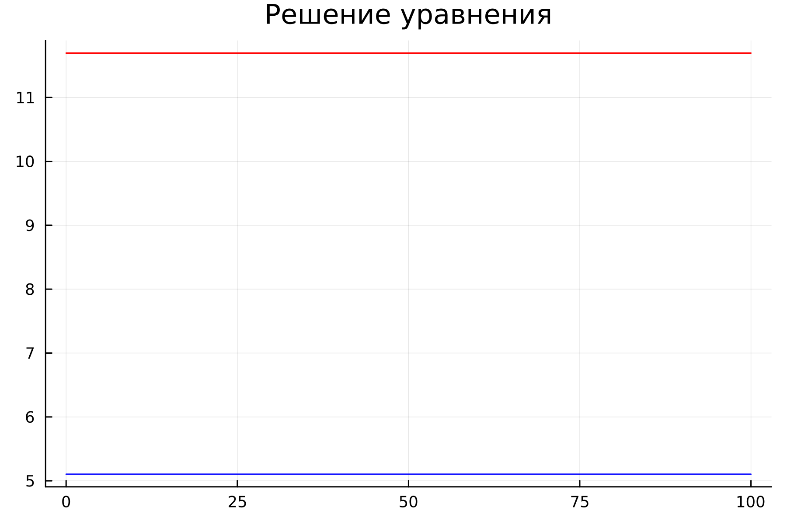
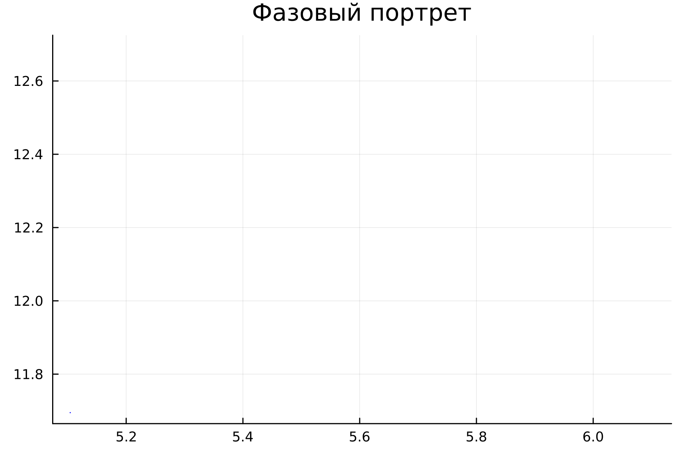
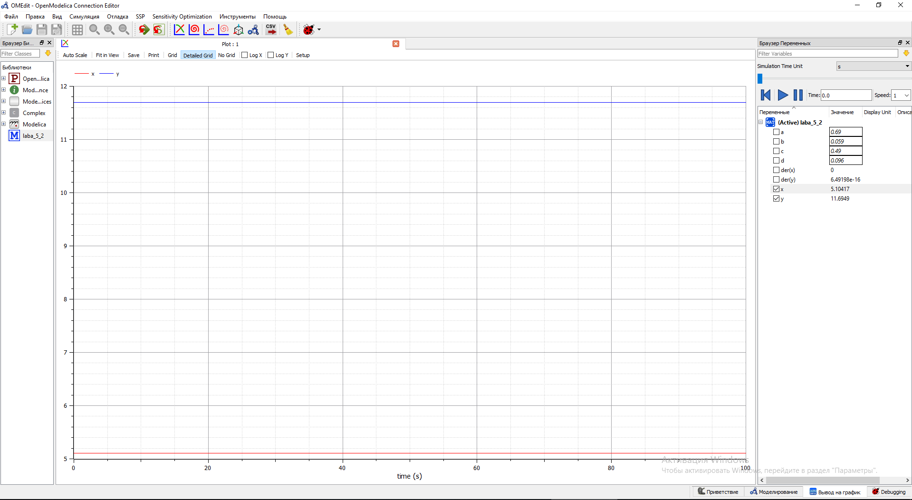
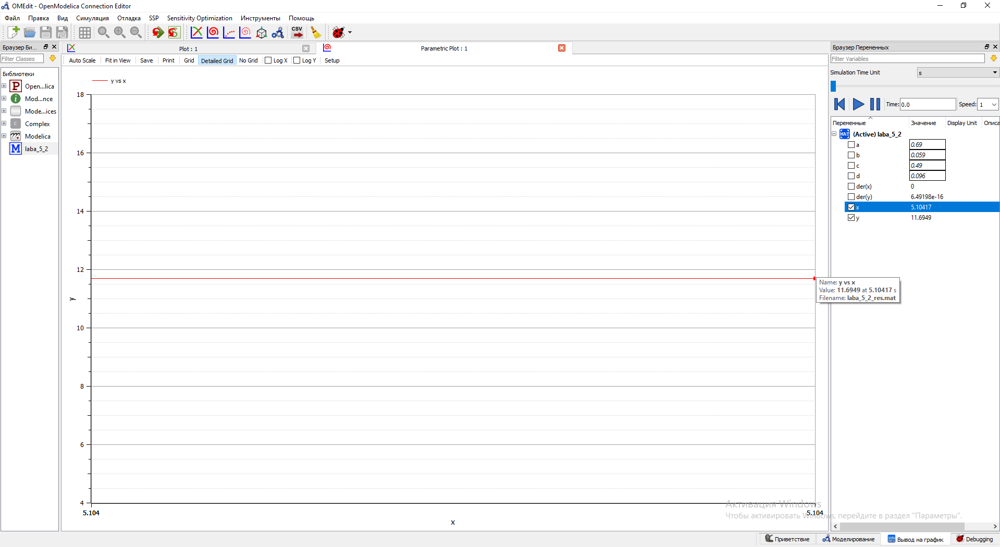

---
# Front matter
lang: ru-RU
title: "Лабораторная работа №5. Модель хищник-жертва Лотки-Вольтерры]."
subtitle: "Вариант №28"
author: "Евдокимов Иван Андреевич. НФИбд-01-20"

## Generic otions
lang: ru-RU
toc-title: "Содержание"

## Bibliography
bibliography: bib/cite.bib
csl: pandoc/csl/gost-r-7-0-5-2008-numeric.csl

## Pdf output format
toc: true # Содержание
toc-depth: 2
lof: true # Список рисунков
lot: false # Список таблиц
fontsize: 12pt
linestretch: 1.5
papersize: a4
documentclass: scrreprt
## I18n polyglossia
polyglossia-lang:
  name: russian
  options:
	- spelling=modern
	- babelshorthands=true
polyglossia-otherlangs:
  name: english
## I18n babel
babel-lang: russian
babel-otherlangs: english
## Fonts
mainfont: PT Serif
romanfont: PT Serif
sansfont: PT Sans
monofont: PT Mono
mainfontoptions: Ligatures=TeX
romanfontoptions: Ligatures=TeX
sansfontoptions: Ligatures=TeX,Scale=MatchLowercase
monofontoptions: Scale=MatchLowercase,Scale=0.9
## Biblatex
biblatex: true
biblio-style: "gost-numeric"
biblatexoptions:
  - parentracker=true
  - backend=biber
  - hyperref=auto
  - language=auto
  - autolang=other*
  - citestyle=gost-numeric
## Pandoc-crossref LaTeX customization
figureTitle: "Рис."
tableTitle: "Таблица"
listingTitle: "Листинг"
lofTitle: "Список иллюстраций"
lotTitle: "Список таблиц"
lolTitle: "Листинги"
## Misc options
indent: true
header-includes:
  - \usepackage{indentfirst}
  - \usepackage{float} # keep figures where there are in the text
  - \floatplacement{figure}{H} # keep figures where there are in the text
---
# Цель работы

Изучить простейшую модель Лотки-Вольтерры хищник-жертва, основанную на нескольких предлоположениях. Построить модель с помощью дифференциальных уравнений. Сделать выводы по заданию

# Задание[@lab-task:mathmod]

1.	Построить график зависимости $x$ от $y$ и графики функций $x(t)$, $y(t)$
2.	Найти стационарное состояние системы

# Выполнение лабораторной работы

## Теоретические сведения[@lab-example:mathmod]

В данной лабораторной работе рассматривается математическая модель системы «Хищник-жертва». 

* Рассмотрим базисные компоненты системы: $X$ хищников и $Y$ жертв.  
* Пусть для этой системы выполняются следующие предположения: (Модель Лотки-Вольтерра)

1.	Численность популяции жертв и хищников зависят только от времени (модель не учитывает пространственное распределение популяции на занимаемой территории) 
2.	В отсутствии взаимодействия численность видов изменяется по модели Мальтуса, при этом число жертв увеличивается, а число хищников падает 
3.	Естественная смертность жертвы и естественная рождаемость хищника считаются несущественными 
4.	Эффект насыщения численности обеих популяций не учитывается 
5.	Скорость роста численности жертв уменьшается пропорционально численности хищников

## Условие задачи и пункты:

В лесу проживают х число волков, питающихся зайцами, число которых в этом же лесу у. Пока число зайцев достаточно велико, для прокормки всех волков, численность волков растет до тех пор, пока не наступит момент, что корма
перестанет хватать на всех. Тогда волки начнут умирать, и их численность будет уменьшаться. В этом случае в какой-то момент времени численность зайцев снова начнет увеличиваться, что повлечет за собой новый рост популяции волков. Такой цикл будет повторяться, пока обе популяции будут существовать. Помимо этого, на численность стаи влияют болезни и старение. 
Данная модель описывается следующим уравнением:

$$
 \begin{cases}
	\frac{dx}{dt} = -ax(t) + by(t)x(t)
	\\   
	\frac{dy}{dt} = cy(t) - dy(t)x(t)
 \end{cases}
$$

## Мой вариант: 
$$
 \begin{cases}
	\frac{dx}{dt} = -0.69x(t) + 0.059y(t)x(t)
	\\   
	\frac{dy}{dt} = 0.49y(t) - 0.096y(t)x(t)
 \end{cases}
$$

Постройте график зависимости численности хищников от численности жертв, а также графики изменения численности хищников и численности жертв при следующих начальных условиях: $x_0=8, y_0=19$. Найдите стационарное состояние системы

## Код программы на Julia общий [@diff-eq-doc:julia]: 
	#Вариант 28
	using Plots
	using DifferentialEquations

	x0 = 8
	y0 = 19
	a = 0.69
	b = 0.059
	c = 0.49
	d = 0.096
	x1 = c/d
	y1 = a/b

	function fn_1(du, u, p, t)
		x, y = u
		du[1] = -a*u[1] + b*u[1]*u[2]
		du[2] = c*u[2] - d*u[1]*u[2]
	end

	function fn_2(du, u, p, t)
		x1 = c/d
		y2 = a/b
		x, y = u
		du[1] = -a*u[1] + b*u[1]*u[2]
		du[2] = c*u[2] - d*u[1]*u[2]
	end

	v0 = [x0, y0]
	tspan = (0, 100)
	prob = ODEProblem(fn_1, v0, tspan)
	sol = solve(prob, dtmax=0.05)

	X1 = [u[1] for u in sol.u]
	Y1 = [u[2] for u in sol.u]
	T = [t for t in sol.t]

	plt = plot(
	dpi=300,
	title="Решение уравнения",
	legend=false)

	plot!(
	plt,
	T,
	X1,
	color=:blue)

	plot!(
	plt,
	T,
	Y1,
	color=:red)

	plt2 = plot(
	dpi=300,
	title="Фазовый портрет",
	legend=false)

	plot!(
	plt2,
	X1,
	Y1,
	color=:blue)

	v1 = [x1, y1]
	tspan = (0, 100)
	prob = ODEProblem(fn_2, v1, tspan)
	sol = solve(prob, dtmax=0.05)

	X2 = [u[1] for u in sol.u]
	Y2 = [u[2] for u in sol.u]
	T = [t for t in sol.t]

	plt3 = plot(
	dpi=300,
	title="Решение уравнения",
	legend=false)

	plot!(
	plt3,
	T,
	X2,
	color=:blue)

	plot!(
	plt3,
	T,
	Y2,
	color=:red)

	plt4 = plot(
	dpi=300,
	title="Фазовый портрет",
	legend=false)

	plot!(
	plt4,
	X2,
	Y2,
	color=:blue)

	savefig(plt, "lab05_1_1.png")
	savefig(plt2, "lab05_1_2.png")
	savefig(plt3, "lab05_2_1.png")
	savefig(plt4, "lab05_2_2.png")
	print(x1,"  ",y1)

## Код программы на OpenModelica: 

	model laba_5_1

	Real x(start=8);
	Real y(start=19);
	parameter Real w( start=0.69);
	parameter Real e( start=0.059);
	parameter Real r( start=0.49);
	parameter Real t( start=0.096);
	

	equation

	der(x)= -w*x + e*x*y;
	der(y)= r*y - t*x*y;
	
	annotation(experiment(StartTime=0, StopTime=100, Tolerance=1e-6, Interval=0.05));

	end laba_5_1;

## Результат: 

{ #fig:001 width=70% height=70% }

{ #fig:002 width=70% height=70% }

{ #fig:001 width=70% height=70% }

{ #fig:002 width=70% height=70% }

# Cтационарное состояние: 

Стационарное состояние $x_0=\frac{c}{d}=5.104166666666666, y_0=\frac{a}{b}=11.694915254237287$

## Код программы на OpenModelica:

	model laba_5_2
	
	  Real x(start=c/d);
	  Real y(start=a/b);
	  parameter Real a( start=0.69);
	  parameter Real b( start=0.059);
	  parameter Real c( start=0.49);
	  parameter Real d( start=0.096);
	  
	
	equation
	
	  der(x)= -a*x + b*x*y;
	  der(y)= c*y - d*x*y;
	  
	  annotation(experiment(StartTime=0, StopTime=100, Tolerance=1e-6, Interval=0.05));
	  
	end laba_5_2;

## Результат: 

{ #fig:001 width=70% height=70% }

{ #fig:002 width=70% height=70% }

{ #fig:001 width=70% height=70% }

{ #fig:002 width=70% height=70% }

# Выводы

В ходе выполнения лабораторной работы была изучена модель хищник-жертва и построены графики зависимости количества хищников и жертв в разных отношениях и в разные периоды времени.

# Список литературы