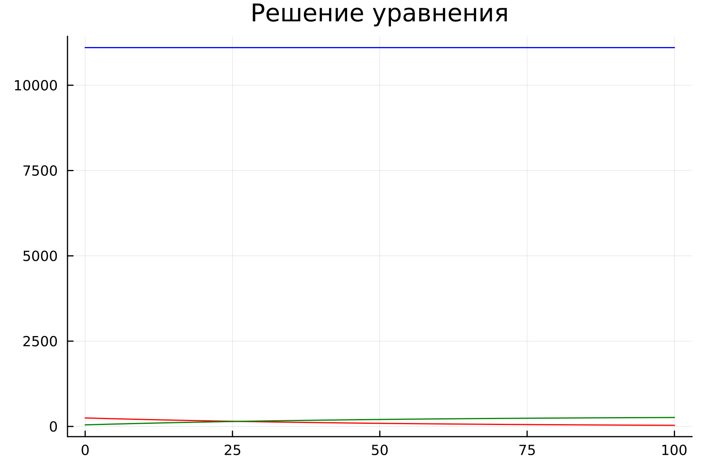
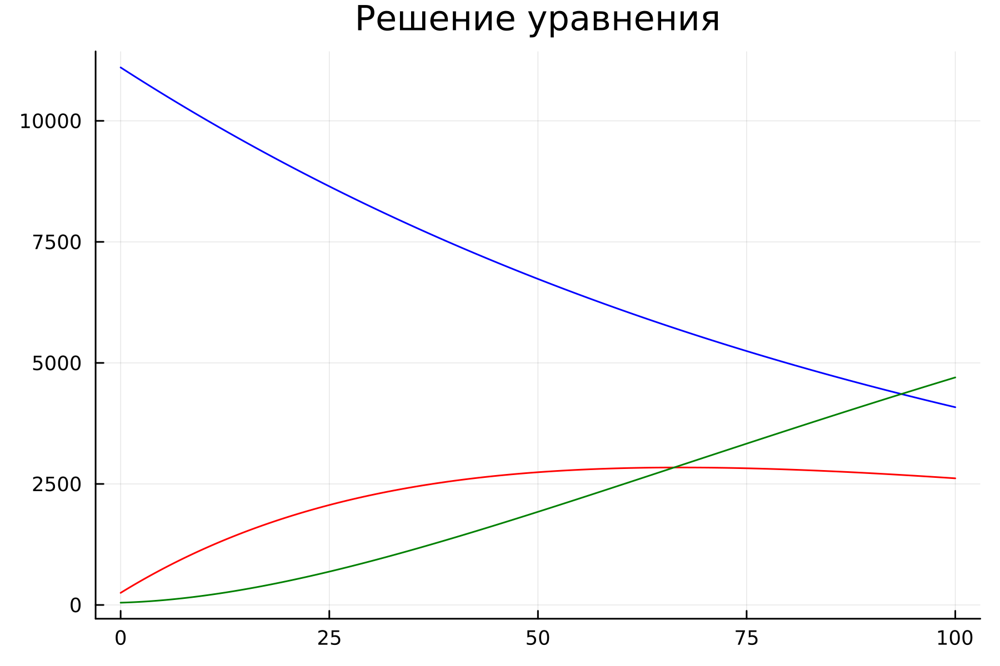
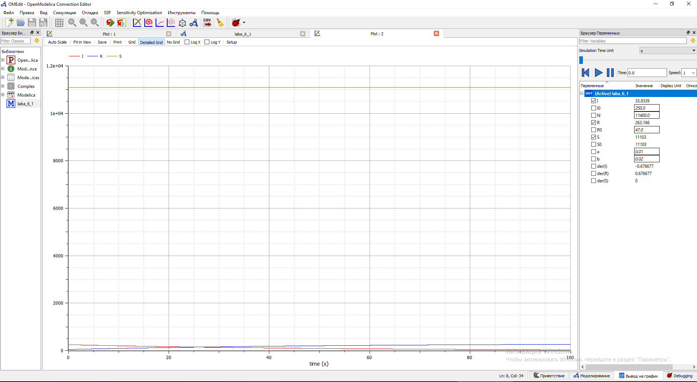
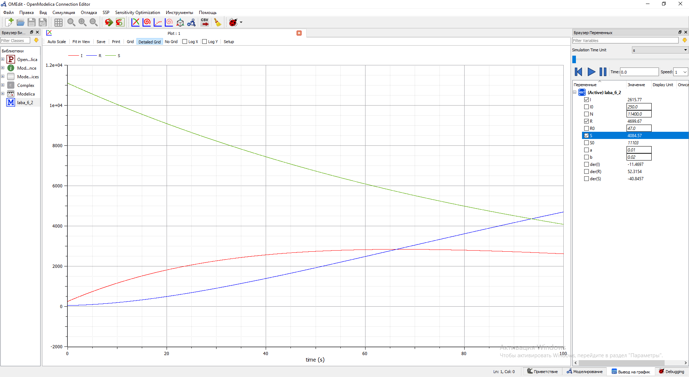

---
# Front matter
lang: ru-RU
title: "Лабораторная работа №6. Модель эпидемии SIR."
subtitle: "Вариант №28"
author: "Евдокимов Иван Андреевич. НФИбд-01-20"

## Generic otions
lang: ru-RU
toc-title: "Содержание"

## Bibliography
bibliography: bib/cite.bib
csl: pandoc/csl/gost-r-7-0-5-2008-numeric.csl

## Pdf output format
toc: true # Содержание
toc-depth: 2
lof: true # Список рисунков
lot: false # Список таблиц
fontsize: 12pt
linestretch: 1.5
papersize: a4
documentclass: scrreprt
## I18n polyglossia
polyglossia-lang:
  name: russian
  options:
	- spelling=modern
	- babelshorthands=true
polyglossia-otherlangs:
  name: english
## I18n babel
babel-lang: russian
babel-otherlangs: english
## Fonts
mainfont: PT Serif
romanfont: PT Serif
sansfont: PT Sans
monofont: PT Mono
mainfontoptions: Ligatures=TeX
romanfontoptions: Ligatures=TeX
sansfontoptions: Ligatures=TeX,Scale=MatchLowercase
monofontoptions: Scale=MatchLowercase,Scale=0.9
## Biblatex
biblatex: true
biblio-style: "gost-numeric"
biblatexoptions:
  - parentracker=true
  - backend=biber
  - hyperref=auto
  - language=auto
  - autolang=other*
  - citestyle=gost-numeric
## Pandoc-crossref LaTeX customization
figureTitle: "Рис."
tableTitle: "Таблица"
listingTitle: "Листинг"
lofTitle: "Список иллюстраций"
lotTitle: "Список таблиц"
lolTitle: "Листинги"
## Misc options
indent: true
header-includes:
  - \usepackage{indentfirst}
  - \usepackage{float} # keep figures where there are in the text
  - \floatplacement{figure}{H} # keep figures where there are in the text
---
# Цель работы

## Цель лабораторной работы:
Изучить простейшую модель эпидемии $SIR$. Используя условия из варианты, задать в уравнение начальные условия и коэффициенты.
После построить графики изменения численностей трех групп в двух случаях.

# Задание[@lab-task:mathmod]
## Задания лабораторной работы:
1.	Изучить модель эпидемии
2.	Построить графики изменения числа особей в каждой из трех групп. 
3.	Рассмотреть, как будет протекать эпидемия в случае: $I(0)\leq I^*$, $I(0)>I^*$


# Ход выполнения лабораторной работы:

## Теоретические сведения[@lab-example:mathmod]:
Рассмотрим простейшую модель эпидемии. Предположим, что некая популяция, состоящая из $N$ особей, (считаем, что популяция изолирована) подразделяется на три группы. Первая группа - это восприимчивые к болезни, но пока здоровые особи, обозначим их через $S(t)$. Вторая группа – это число инфицированных особей, которые также при этом являются распространителями инфекции, обозначим их $I(t)$. А третья группа, обозначающаяся через $R(t)$ – это здоровые особи с иммунитетом к болезни. 
До того, как число заболевших не превышает критического значения $I^*$, считаем, что все больные изолированы и не заражают здоровых. Когда $I(t)> I^*$, тогда инфицирование способны заражать восприимчивых к болезни особей. 

Таким образом, скорость изменения числа $S(t)$ меняется по следующему закону:

$$
\frac{dS}{dt}=
 \begin{cases}
	-\alpha S &\text{,если $I(t) > I^*$}
	\\   
	0 &\text{,если $I(t) \leq I^*$}
 \end{cases}
$$

## Теоретические сведения
Поскольку каждая восприимчивая к болезни особь, которая, в конце концов, заболевает, сама становится инфекционной, то скорость изменения числа инфекционных особей представляет разность за единицу времени между заразившимися и теми, кто уже болеет и лечится. Т.е.:

$$
\frac{dI}{dt}=
 \begin{cases}
	\alpha S -\beta I &\text{,если $I(t) > I^*$}
	\\   
	-\beta I &\text{,если $I(t) \leq I^*$}
 \end{cases}
$$

## Теоретические сведения
Рассмотрим скорость изменения выздоравливающих особей, которые при этом приобретают иммунитет к болезни:

$$\frac{dR}{dt} = \beta I$$

Постоянные пропорциональности $\alpha, \beta$ - это коэффициенты заболеваемости и выздоровления соответственно. Для того, чтобы решения соответствующих уравнений определялось однозначно, необходимо задать начальные условия. Считаем, что на начало эпидемии в момент времени $t=0$ нет особей с иммунитетом к болезни $R(0)=0$, а число инфицированных и восприимчивых к болезни особей $I(0)$ и $S(0)$ соответственно. Для анализа картины протекания эпидемии необходимо рассмотреть два случая:  $I(0) \leq I^*$ и  $I(0)>I^*$

# Задача[@lab-task:mathmod]
## Условие задачи:
На одном небольшом острове вспыхнула эпидемия. 
Известно, что из всех проживающих на острове $(N=11400)$ в момент начала эпидемии $(t=0)$ число заболевших людей (являющихся распространителями инфекции) $I(0)=250$.
Число здоровых людей с иммунитетом к болезни $R(0)=47$. 
Таким образом, число людей восприимчивых к болезни, но пока здоровых, в начальный момент времени $S(0)=N-I(0)-R(0)$.
Постройте графики изменения числа особей в каждой из трех групп.
Рассмотрите, как будет протекать эпидемия в случае:
1.	$I(0)\leq I^*$
2.	$I(0)>I^*$

# Код программы
## Код программы на Julia общий: [@diff-eq-doc:julia]
```
# Вариант 28
using Plots
using DifferentialEquations

N = 11400
I0 = 250
R0 = 47
a = 0.01
b = 0.02
S0 = N - I0 - R0

function fn_1(du, u, p, t)
    S0 , I0, R0 = u
    du[1] = 0
    du[2] = -b*u[2]
    du[3] = b*u[2]
end

function fn_2(du, u, p, t)
    S0, I0, R0 = u
    du[1] = -a*u[1]
    du[2] = a*u[1] - b*u[2]
    du[3] = b*u[2]
end

v0 = [S0, I0, R0]
tspan = (0, 100)
prob = ODEProblem(fn_1, v0, tspan)
sol = solve(prob, dtmax=0.01)

S = [u[1] for u in sol.u]
I = [u[2] for u in sol.u]
R = [u[3] for u in sol.u]
T = [t for t in sol.t]

plt = plot(
  dpi=300,
  title="Решение уравнения",
  legend=false)

plot!(
  plt,
  T,
  S,
  color=:blue)

plot!(
  plt,
  T,
  I,
  color=:red)

  plot!(
  plt,
  T,
  R,
  color=:green)

v0 = [S0, I0, R0]
tspan = (0, 100)
prob = ODEProblem(fn_2, v0, tspan)
sol = solve(prob, dtmax=0.01)

S = [u[1] for u in sol.u]
I = [u[2] for u in sol.u]
R = [u[3] for u in sol.u]
T = [t for t in sol.t]

plt2 = plot(
  dpi=300,
  title="Решение уравнения",
  legend=false)

plot!(
  plt2,
  T,
  S,
  color=:blue)

plot!(
  plt2,
  T,
  I,
  color=:red)

  plot!(
  plt2,
  T,
  R,
  color=:green)


  savefig(plt, "lab06_1.png")
  savefig(plt2, "lab06_2.png")
```

## Код программы на OpenModelica:
```
model laba_6_1

  parameter Real N(start=11400);
  parameter Real I0(start=250);
  parameter Real R0(start=47);
  parameter Real a( start=0.01);
  parameter Real b( start=0.02);
  parameter Real S0 = N - I0 - R0;
  Real S(start=S0);
  Real I(start=I0);
  Real R(start=R0);
  
equation

  der(S) = 0;
  der(I) = -b*I;
  der(R) = b*I;
  
  annotation(experiment(StartTime=0, StopTime=100, Tolerance=1e-6, Interval=0.01));

end laba_6_1;
```
```
model laba_6_2

  parameter Real N(start=11400);
  parameter Real I0(start=250);
  parameter Real R0(start=47);
  parameter Real a( start=0.01);
  parameter Real b( start=0.02);
  parameter Real S0 = N - I0 - R0;
  Real S(start=S0);
  Real I(start=I0);
  Real R(start=R0);
  
equation

  der(S) = -a*S;
  der(I) = a*S-b*I;
  der(R) = b*I;
  
  annotation(experiment(StartTime=0, StopTime=100, Tolerance=1e-6, Interval=0.01));
  
end laba_6_2;
```
# Результаты работы
## Результаты работы на Julia:

{ #fig:001 width=70% height=70% }

{ #fig:002 width=70% height=70% }

## Результаты работы на OpenModelica:

{ #fig:001 width=70% height=70% }

{ #fig:002 width=70% height=70% }

# Выводы
В ходе выполнения лабораторной работы была изучена простейшая модель эпидемии и построены графики на основе условий задачи и начальных данных, которые были описаны в варианте лабораторной работы.

# Список литературы 
