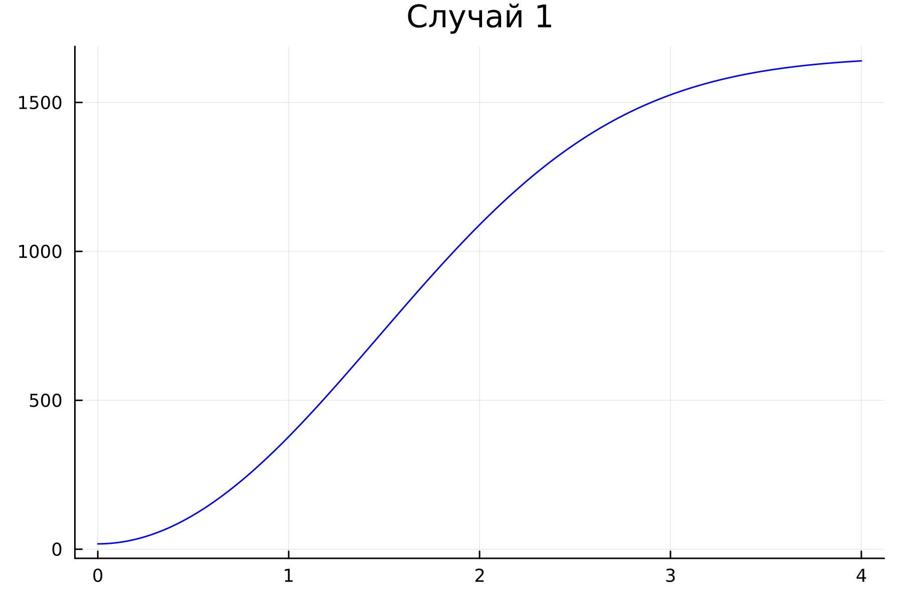
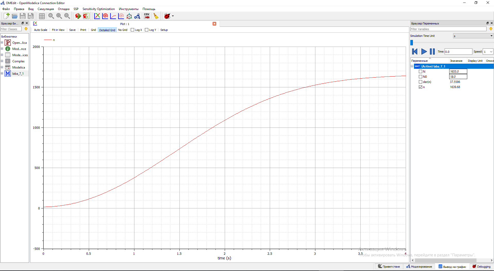
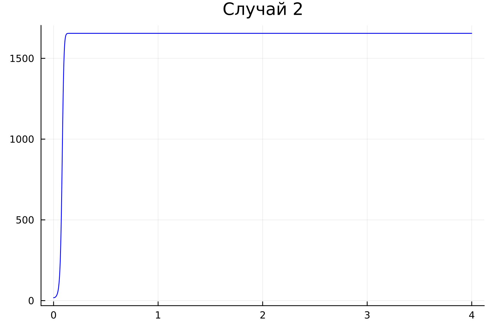
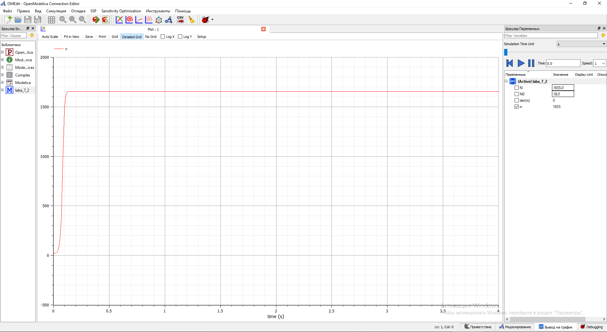

---
## Front matter
lang: ru-RU
title: "Лабораторная работа №7. Модель распространения рекламы."
author:
    - Евдокимов Иван Андреевич. НФИбд-01-20

institute:
    - Российский Университет Дружбы Народов

date: 14 марта, 2023, Москва, Россия

## Formatting
mainfont: PT Serif
romanfont: PT Serif
sansfont: PT Sans
monofont: PT Mono
toc: false
slide_level: 2
theme: metropolis
header-includes: 
 - \metroset{progressbar=frametitle,sectionpage=progressbar,numbering=fraction}
 - '\makeatletter'
 - '\beamer@ignorenonframefalse'
 - '\makeatother'
aspectratio: 43
section-titles: true
---
# Цели и задачи работы

## Цель лабораторной работы

Изучить модель эффективности распространения рекламы о салоне красоты. Задать эффективность в двух случаях.
Построить решение на основе начальных данных. Сделать на основании построений выводы.

## Задание к лабораторной работе

1.	Изучить модель эфеективности распространения рекламы
2.	Построить графики распространения рекламы в трех заданных случайх
3.	Определить для случая 2 момент времени, в который скорость распространения рекламы будет максимальной
4.	Сделать выводы из трех моделей

# Процесс выполнения лабораторной работы

## Теоретический материал 

$\frac{dn}{dt}$ - скорость изменения со временем числа потребителей, узнавших о товаре и готовых его купить,
$t$ - время, прошедшее с начала рекламной кампании,
$N$ - общее число потенциальных платежеспособных покупателей,
$n(t)$ - число  уже информированных клиентов.

## Теоретический материал 

Величина $n(t)$ пропорциональна числу покупателей, еще не знающих о нем, это описывается следующим образом
$\alpha _1(t)(N-n(t))$, где $\alpha _1>0$ -  характеризует интенсивность рекламной кампании.
Помимо этого, узнавшие о товаре потребители также распространяют полученную информацию среди потенциальных покупателей, не знающих о нем. Этот вклад в рекламу описывается величиной  $\alpha _2(t)n(t)(N-n(t))$. эта величина увеличивается с увеличением потребителей узнавших о товаре.

## Теоретический материал

Математическая модель распространения рекламы описывается уравнением:
$$\frac{dn}{dt} = (\alpha _1(t) + \alpha _2(t)n(t))(N-n(t))$$

## Теоретический материал

При $\alpha _1(t) >> \alpha _2(t)$ получается модель типа модели Мальтуса 

## Теоретический материал

В обратном случае $\alpha _1(t) << \alpha _2(t)$ получаем уравнение логистической кривой

# Задача
## Условие задачи

Постройте график распространения рекламы, математическая модель которой описывается следующим уравнением:

1.	$\frac{dn}{dt} = (0.48 + 0.000081n(t))(N-n(t))$
2.	$\frac{dn}{dt} = (0.000049 + 0.82n(t))(N-n(t))$
3.	$\frac{dn}{dt} = (0.6 t + 0.3 sin (3t))(N-n(t))$

При этом объем аудитории $N = 1655$, в начальный момент о товаре знает 18 человек.

Для случая 2 определите в какой момент времени скорость распространения рекламы будет иметь максимальное значение.

## Графики изменения численности в первом случае

 | 
|--|--|
{ #fig:001 width=45%} | { #fig:001 width=45% }

## Графики изменения численности во втором случае

 | 
|--|--|
{ #fig:002 width=45% } | { #fig:001 width=45% }

## Графики изменения численности в третьем случае

 | 
|--|--|
{ #fig:002 width=45% } | { #fig:001 width=45% }

# Выводы по проделанной работе
## Вывод

В ходе выполнения лабораторной работы была изучена модель эффективности рекламы и построены графики. Также эти графики были изучены и сделаны выводе о работе программ и эффективности распространения.