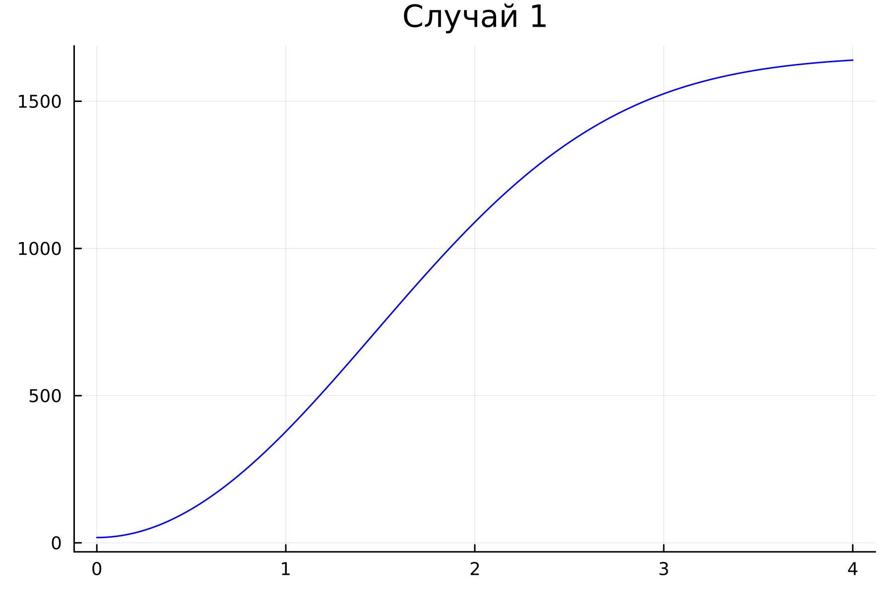
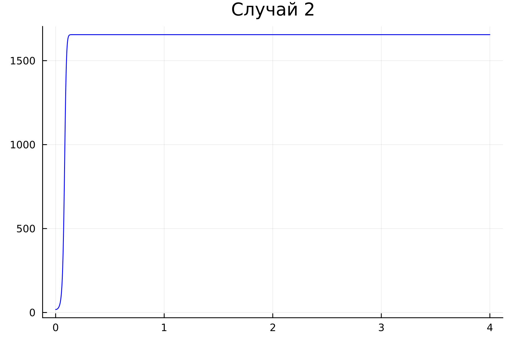
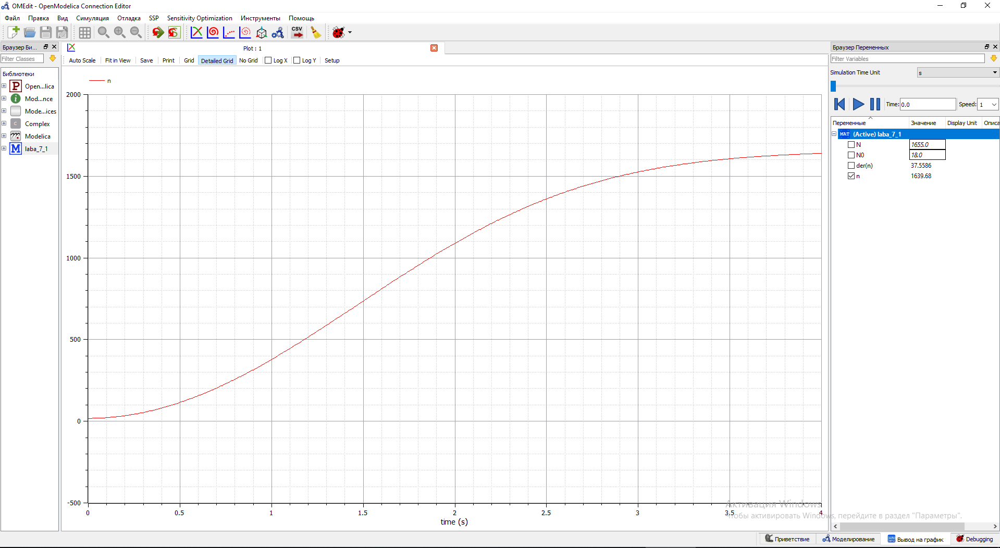
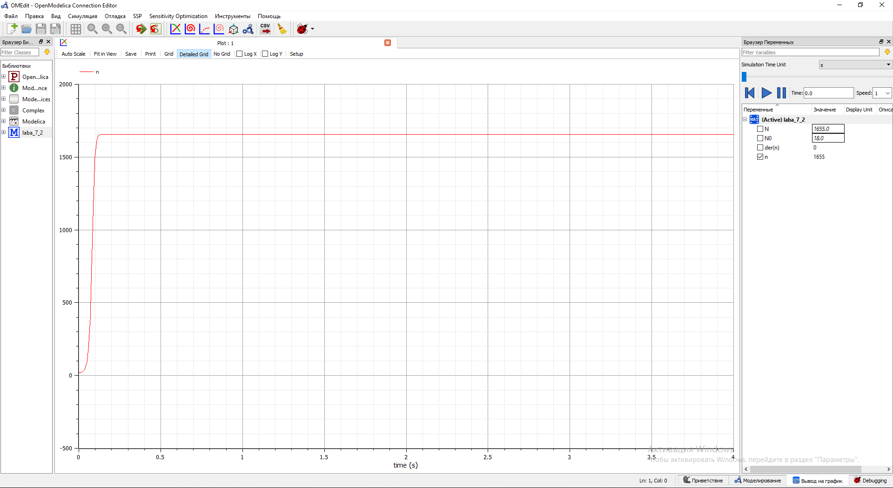

---
# Front matter
lang: ru-RU
title: "Лабораторная работа №7. Модель распространения рекламы."
subtitle: "Вариант №28"
author: "Евдокимов Иван Андреевич. НФИбд-01-20"

## Generic otions
lang: ru-RU
toc-title: "Содержание"

## Bibliography
bibliography: bib/cite.bib
csl: pandoc/csl/gost-r-7-0-5-2008-numeric.csl

## Pdf output format
toc: true # Содержание
toc-depth: 2
lof: true # Список рисунков
lot: false # Список таблиц
fontsize: 12pt
linestretch: 1.5
papersize: a4
documentclass: scrreprt
## I18n polyglossia
polyglossia-lang:
  name: russian
  options:
	- spelling=modern
	- babelshorthands=true
polyglossia-otherlangs:
  name: english
## I18n babel
babel-lang: russian
babel-otherlangs: english
## Fonts
mainfont: PT Serif
romanfont: PT Serif
sansfont: PT Sans
monofont: PT Mono
mainfontoptions: Ligatures=TeX
romanfontoptions: Ligatures=TeX
sansfontoptions: Ligatures=TeX,Scale=MatchLowercase
monofontoptions: Scale=MatchLowercase,Scale=0.9
## Biblatex
biblatex: true
biblio-style: "gost-numeric"
biblatexoptions:
  - parentracker=true
  - backend=biber
  - hyperref=auto
  - language=auto
  - autolang=other*
  - citestyle=gost-numeric
## Pandoc-crossref LaTeX customization
figureTitle: "Рис."
tableTitle: "Таблица"
listingTitle: "Листинг"
lofTitle: "Список иллюстраций"
lotTitle: "Список таблиц"
lolTitle: "Листинги"
## Misc options
indent: true
header-includes:
  - \usepackage{indentfirst}
  - \usepackage{float} # keep figures where there are in the text
  - \floatplacement{figure}{H} # keep figures where there are in the text
---
# Цель работы

## Цель лабораторной работы:

Изучить модель эффективности распространения рекламы о салоне красоты. Задать эффективность в трёх случаях.
Построить решение на основе начальных данных. Сделать на основании построений выводы.

# Задание[@lab-task:mathmod]
## Задания лабораторной работы:

1.	Изучить модель эфеективности распространения рекламы
2.	Построить графики распространения рекламы в трех заданных случайх
3.	Определить для случая 2 момент времени, в который скорость распространения рекламы будет максимальной
4.	Сделать выводы из трех моделей

# Ход выполнения лабораторной работы:

## Теоретические сведения[@lab-example:mathmod]:
Организуется рекламная кампания нового товара или услуги. Необходимо, чтобы прибыль будущих продаж с избытком покрывала издержки на рекламу. Вначале расходы могут превышать прибыль, поскольку лишь малая часть потенциальных покупателей будет информирована о новинке. Затем, при увеличении числа продаж, возрастает и прибыль, и, наконец, наступит момент, когда рынок насытиться, и рекламировать товар станет бесполезным.

Предположим, что торговыми учреждениями реализуется некоторая продукция, о которой в момент времени $t$ из числа потенциальных покупателей $N$ знает лишь $n$ покупателей. Для ускорения сбыта продукции запускается реклама по радио, телевидению и других средств массовой информации. После запуска рекламной кампании информация о продукции начнет распространяться среди потенциальных покупателей путем общения друг с другом. Таким образом, после запуска рекламных объявлений скорость изменения числа знающих о продукции людей пропорциональна как числу знающих о товаре покупателей, так и числу покупателей о нем не знающих

Модель рекламной кампании описывается следующими величинами.
Считаем, что $\frac{dn}{dt}$ - скорость изменения со временем числа потребителей, узнавших о товаре и готовых его купить,
$t$ - время, прошедшее с начала рекламной кампании,
$N$ - общее число потенциальных платежеспособных покупателей,
$n(t)$ - число  уже информированных клиентов.
Эта величина пропорциональна числу покупателей, еще не знающих о нем, это описывается следующим образом
$\alpha _1(t)(N-n(t))$, где $\alpha _1>0$ -  характеризует интенсивность рекламной кампании (зависит от затрат на рекламу в данный момент времени).
Помимо этого, узнавшие о товаре потребители также распространяют полученную информацию среди потенциальных покупателей, не знающих о нем (в этом случае работает т.н. сарафанное радио). Этот вклад в рекламу описывается величиной  $\alpha _2(t)n(t)(N-n(t))$. эта величина увеличивается с увеличением потребителей узнавших о товаре.

## Теоретические сведения
Математическая модель распространения рекламы описывается уравнением:

$$\frac{dn}{dt} = (\alpha _1(t) + \alpha _2(t)n(t))(N-n(t))$$

При $\alpha _1(t) >> \alpha _2(t)$ получается модель типа модели Мальтуса.

В обратном случае $\alpha _1(t) << \alpha _2(t)$ получаем уравнение логистической кривой

# Задача[@lab-task:mathmod]
## Условие задачи:

Постройте график распространения рекламы, математическая модель которой описывается следующим уравнением:

1.	$\frac{dn}{dt} = (0.48 + 0.000081n(t))(N-n(t))$
2.	$\frac{dn}{dt} = (0.000049 + 0.82n(t))(N-n(t))$
3.	$\frac{dn}{dt} = (0.6 t + 0.3 sin (3t))(N-n(t))$

При этом объем аудитории $N = 1655$, в начальный момент о товаре знает 18 человек.

Для случая 2 определите в какой момент времени скорость распространения рекламы будет иметь максимальное значение.

# Код программы
## Код программы на Julia общий: [@diff-eq-doc:julia]

	# Вариант 28
	using Plots
	using DifferentialEquations
	
	N = 1655
	N0 = 18
	
	function fn_1(du, u, p, t)
	    du[1] = (0.48*t + 0.000081*t*u[1])*(N-u[1])
	end
	
	function fn_2(du, u, p, t)
	    du[1] = (0.000049*t + 0.82*t*u[1])*(N-u[1])
	end
	
	function fn_3(du, u, p, t)
	    du[1] = (0.6*t + 0.3*sin(3*t)*u[1])*(N-u[1])
	end
	
	v0 = [N0]
	tspan = (0, 4)
	prob = ODEProblem(fn_1, v0, tspan)
	sol = solve(prob, dtmax=0.001)
	
	N1 = [u[1] for u in sol.u]
	T = [t for t in sol.t]
	
	plt = plot(
	  dpi=300,
	  title="Случай 1",
	  legend=false)
	
	plot!(
	  plt,
	  T,
	  N1,
	  color=:blue)
	
	v0 = [N0]
	tspan = (0, 4)
	prob = ODEProblem(fn_2, v0, tspan)
	sol = solve(prob, dtmax=0.001)
	
	N2 = [u[1] for u in sol.u]
	T = [t for t in sol.t]
	
	plt2 = plot(
	  dpi=300,
	  title="Случай 2",
	  legend=false)
	
	plot!(
	  plt2,
	  T,
	  N2,
	  color=:blue)
	
	v0 = [N0]
	tspan = (0, 4)
	prob = ODEProblem(fn_3, v0, tspan)
	sol = solve(prob, dtmax=0.001)
	
	N3 = [u[1] for u in sol.u]
	T = [t for t in sol.t]
	
	plt3 = plot(
	  dpi=300,
	  title="Случай 3",
	  legend=false)
	
	plot!(
	  plt3,
	  T,
	  N3,
	  color=:blue)
	
	savefig(plt, "Z:/PETON/mm7/lab07_1.png")
	savefig(plt2, "Z:/PETON/mm7/lab07_2.png")
	savefig(plt3, "Z:/PETON/mm7/lab07_3.png")

## Код программы на OpenModelica:

	model laba_7_1
	
	parameter Real N = 1655;
	parameter Real N0 = 18;
	Real n( start = N0);
	
	function k
	  input Real t;
	  output Real result;
	algorithm
	  result:= 0.48*t;
	end k;
	
	function p
	  input Real t;
	  output Real result;
	algorithm
	  result:=  0.000081*t;
	end p;
	
	equation
	
	der(n)=(k(time)+p(time)*n)*(N-n);
	
	  annotation(experiment(StartTime=No, StopTime=4, Tolerance=1e-6, Interval=0.01));
	
	end laba_7_1;

	model laba_7_2
	
	parameter Real N = 1655;
	parameter Real N0 = 18;
	Real n( start = N0);
	
	function k
	  input Real t;
	  output Real result;
	algorithm
	  result:= 0.000049*t;
	end k;
	
	function p
	  input Real t;
	  output Real result;
	algorithm
	  result:=  0.82*t;
	end p;
	
	equation
	der(n)=(k(time)+p(time)*n)*(N-n);
	
	  annotation(experiment(StartTime=No, StopTime=4, Tolerance=1e-6, Interval=0.01));
	
	end laba_7_2;

	model laba_7_3
	
	parameter Real N = 1655;
	parameter Real N0 = 18;
	Real n( start = N0);
	
	function k
	  input Real t;
	  output Real result;
	algorithm
	  result:= 0.6*t;
	end k;
	
	function p
	  input Real t;
	  output Real result;
	algorithm
	  result:= 0.3*sin(3*t);
	end p;
	
	equation
	der(n)=(k(time)+p(time)*n)*(N-n);
	
	  annotation(experiment(StartTime=No, StopTime=4, Tolerance=1e-6, Interval=0.01));
	  
	end laba_7_3;

# Результаты работы
## Результаты работы на Julia:

{ #fig:001 width=70% height=70% }

{ #fig:002 width=70% height=70% }

{ #fig:003 width=70% height=70% }

## Результаты работы на OpenModelica:

{ #fig:011 width=70% height=70% }

{ #fig:022 width=70% height=70% }

{ #fig:033 width=70% height=70% }

# Выводы

В ходе выполнения лабораторной работы была изучена модель эффективности рекламы и построены графики. Также эти графики были изучены и сделаны выводе о работе программ и эффективности распространения.

# Список литературы 
