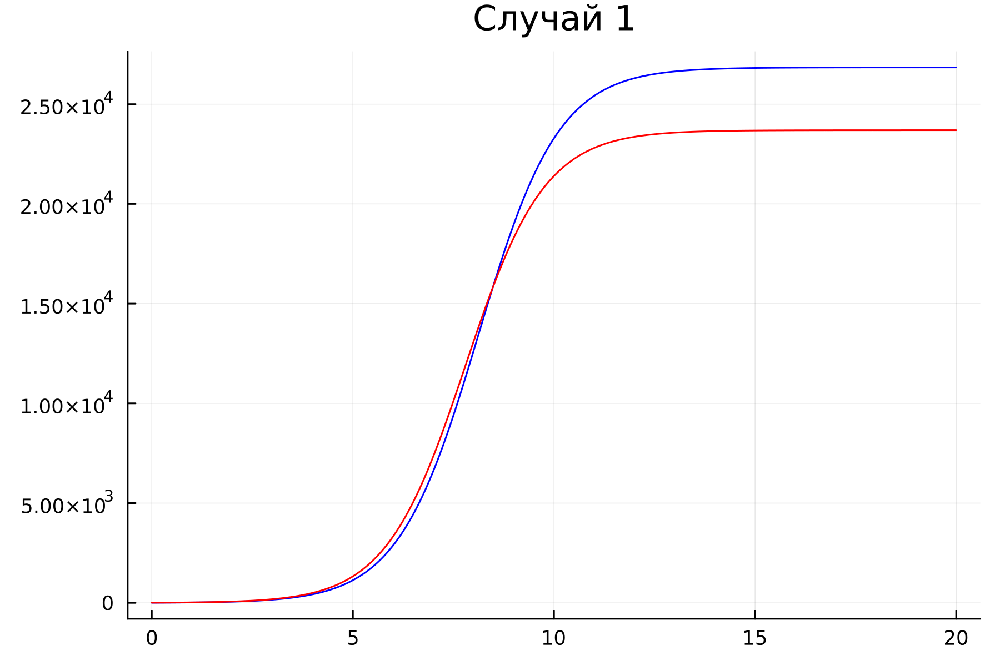
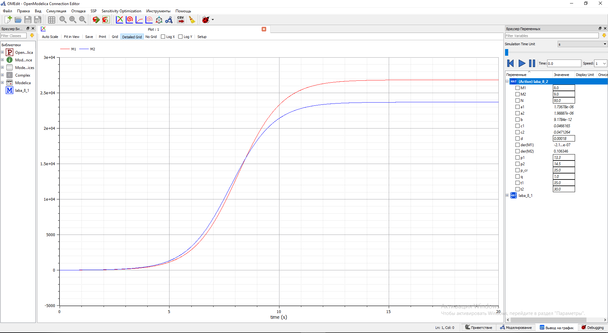
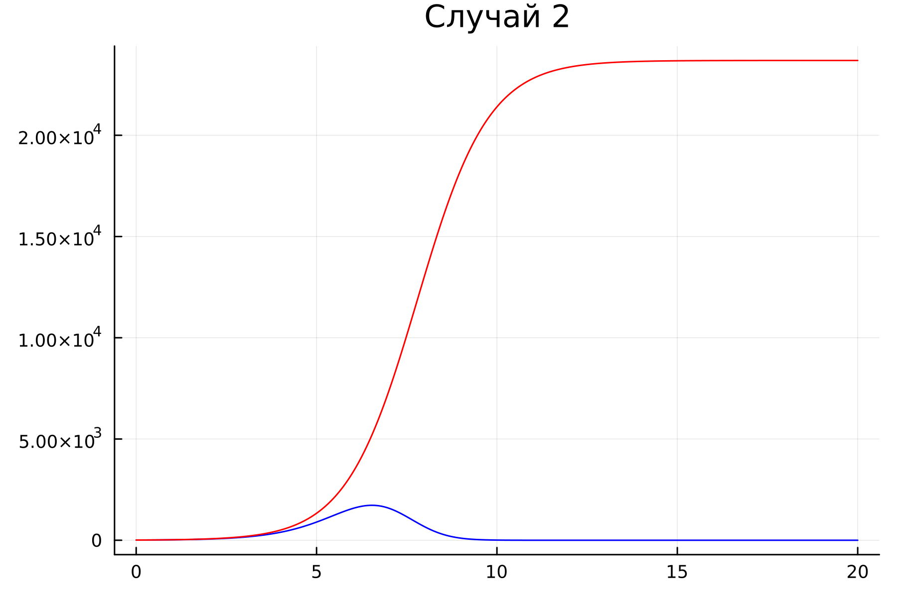
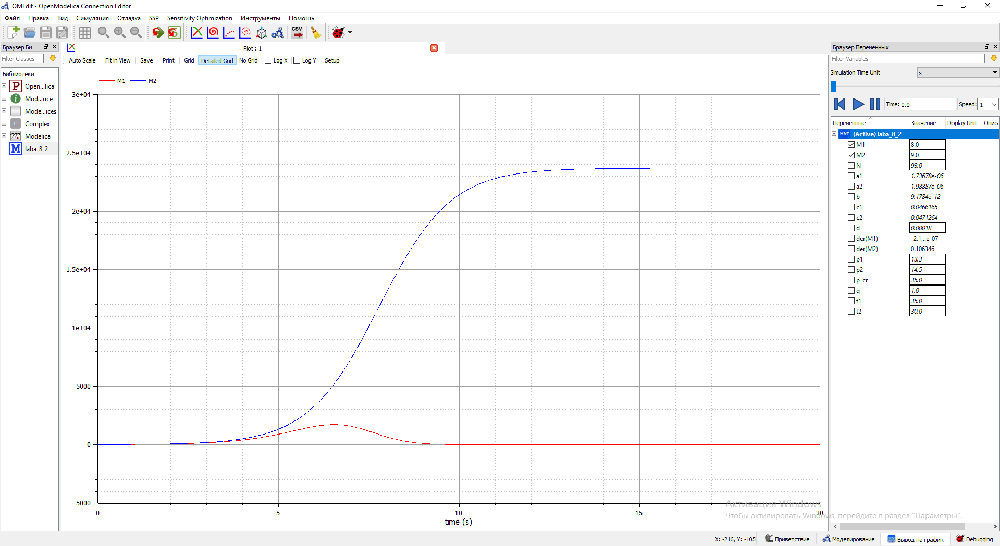

---
## Front matter
lang: ru-RU
title: "Лабораторная работа №8. Модель конкуренции двух фирм."
author:
    - Евдокимов Иван Андреевич. НФИбд-01-20

institute:
    - Российский Университет Дружбы Народов

date: 16 марта, 2023, Москва, Россия

## Formatting
mainfont: PT Serif
romanfont: PT Serif
sansfont: PT Sans
monofont: PT Mono
toc: false
slide_level: 2
theme: metropolis
header-includes: 
 - \metroset{progressbar=frametitle,sectionpage=progressbar,numbering=fraction}
 - '\makeatletter'
 - '\beamer@ignorenonframefalse'
 - '\makeatother'
aspectratio: 43
section-titles: true
---
# Цели и задачи работы

## Цель лабораторной работы

Изучить модель конкуренции для двух фирм и в двух случаях. Построить графики с помощью представленных уравнений, описивающих случаи.

## Задание к лабораторной работе

1.	Изучить модель конкуренции двух фирм
2.	Изучить случаи представленные в варианте
3.	Построить графики изменения оборотных средств в двух случаях

# Процесс выполнения лабораторной работы

## Теоретический материал 

Обозначения:

$N$ - число потребителей производимого продукта. 

$S$ – доходы потребителей данного продукта.

$M$ – оборотные средства предприятия 

$\tau$ - длительность производственного цикла

$p$ - рыночная цена товара 

$\widetilde{p}$ - себестоимость продукта

$\delta$ - доля оборотных средств, идущая на покрытие переменных издержек

$k$ - постоянные издержки, которые не зависят от количества выпускаемой продукции

## Теоретический материал 

Функция спроса: 

$$Q = q - k\frac{p}{S} = q(1 - \frac{p}{p_{cr}})$$

Уравнения динамики оборотных средств:

$$ \frac{dM}{dt} = -\frac{M \delta}{\tau} + NQp - k = -\frac{M\delta}{\tau} + Nq(1 - \frac{p}{p_{cr}})p - k $$

Уравнение для рыночной цены $p$ :

$$ \frac{dp}{dt} = \gamma (-\frac{M\delta}{\tau \widetilde{p}} + Nq(1-\frac{p}{p_{cr}}) ) $$

## Теоретический материал 

При заданном M уравнение описывает быстрое стремление цены к равновесному значению цены, которое устойчиво.
В этом случае уравнение можно заменить алгебраическим соотношением

$$ -\frac{M\delta}{\tau \widetilde{p}} + Nq(1-\frac{p}{p_{cr}}) = 0$$

Равновесное значение цены $p$ равно

$$ p = p_{cr}(1 - \frac{M\delta}{\tau \widetilde{p} Nq})$$

## Теоретический материал

Уравнения динамики оборотных средств

$$\frac{dM}{dt} = -\frac{M \delta}{\tau}(\frac{p}{p_{cr}}-1) - M^2 ( \frac{\delta}{\tau \widetilde{p} })^2 \frac{p_{cr}}{Nq} - k$$

Стационарное состояние

$$ \widetilde{M_{1,2}} = \frac{1}{2} a \pm \sqrt{\frac{a^2}{4} - b}$$

где 

$$ a = Nq(1 - \frac{\widetilde{p}}{p_{cr}} \widetilde{p} \frac{\tau}{\delta}), b = kNq \frac{(\tau \widetilde{p})^2}{p_{cr}\delta ^2} $$

## Теоретический материал

При больших постоянных издержках (в случае $a^2 < 4b$) стационарных состояний нет.

При $b << a$ стационарные значения $M$ равны

$$ \widetilde{M_{+}} = Nq \frac{\tau}{\delta}(1 - \frac{\widetilde{p}}{p_{cr}})\widetilde{p}, \widetilde{M_{-}} = k\widetilde{p} \frac{\tau}{\delta(p_{cr} - \widetilde{p})} $$

# Задача
## Условие задачи

Случай 1

Динамика изменения объемов продаж фирмы 1 и фирмы 2 описывается следующей системой уравнений:

$$\frac{dM_1}{d\Theta} = M_1 - \frac{b}{c_1}M_1 M_2 - \frac{a1}{c1} M_1^2 $$

$$ \frac{dM_2}{d\Theta} = \frac{c_2}{c_1} M_2 - \frac{b}{c_1} M_1 M_2 - \frac{a_2}{c_1} M_2^2$$

также введена нормировка $t = c_1 \Theta$ и где 

$$ a_i = \frac{p_{cr}}{\tau_i^2 \widetilde{p}_1^2 Nq }, b = \frac{p_{cr}}{\tau_1^2 \widetilde{p}_1^2 \tau_2^2 \widetilde{p}_2^2 Nq}, c_i = \frac{p_{cr} - \widetilde{p}_i}{\tau_i \widetilde{p}_i} $$

## Условие задачи

Случай 2

Динамика изменения объемов продаж фирмы 1 и фирмы 2 описывается следующей системой уравнений:

$$\frac{dM_1}{d\Theta} = M_1 - (\frac{b}{c_1} + 0.00018)M_1 M_2 - \frac{a1}{c1} M_1^2 $$

$$ \frac{dM_2}{d\Theta} = \frac{c_2}{c_1} M_2 - \frac{b}{c_1} M_1 M_2 - \frac{a_2}{c_1} M_2^2$$

## Для обоих случаев рассмотрим задачу со следующими начальными условиями и параметрами

$$ M_0^1=8 \: M_0^2=9 $$
$$ p_{cr}=35 \: N=93 \: q=1 $$
$$ \tau_1=35 \: \tau_2=30 $$
$$ \widetilde{p}_1=13.3 \: \widetilde{p}_2=14.5 $$

## Графики изменения численности в первом случае

 | 
|--|--|
{ #fig:001 width=45%} | { #fig:001 width=45% }

## Графики изменения численности во втором случае

 | 
|--|--|
{ #fig:002 width=45% } | { #fig:001 width=45% }

# Выводы по проделанной работе
## Вывод

В ходе выполнения лабораторной работы была изучена модель конкуренции двух фирм и построены графики.